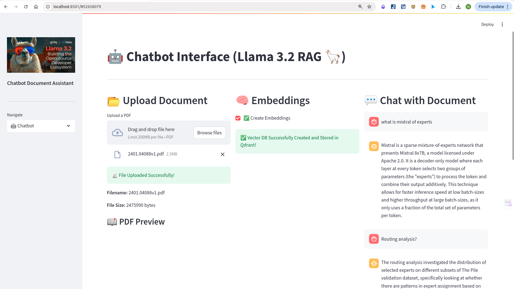

# 📄 RAG App



**RAG App** is a powerful Streamlit-based application designed to simplify document management. Upload your PDF documents, create embeddings for efficient retrieval, and interact with your documents through an intelligent chatbot interface. 🚀

## 🛠️ Features
- **📂 Upload Documents**: Easily upload PDF documents within the app.
- **🧠 Create Embeddings**: Generate embeddings to enable efficient retrieval.
- **🤖 Chatbot Interface**: Interact with your documents using a smart chatbot that leverages the created embeddings.

## 🖥️ Tech Stack

The Document Buddy App leverages a combination of cutting-edge technologies to deliver a seamless and efficient user experience. Here's a breakdown of the technologies and tools used:

- **[LangChain](https://langchain.readthedocs.io/)**: Utilized as the orchestration framework to manage the flow between different components, including embeddings creation, vector storage, and chatbot interactions.
  
- **[Unstructured](https://github.com/Unstructured-IO/unstructured)**: Employed for robust PDF processing, enabling the extraction and preprocessing of text from uploaded PDF documents.
  
- **[BGE Embeddings from HuggingFace](https://huggingface.co/BAAI/bge-small-en)**: Used to generate high-quality embeddings for the processed documents, facilitating effective semantic search and retrieval.
  
- **[Qdrant](https://qdrant.tech/)**: A vector database running locally via Docker, responsible for storing and managing the generated embeddings for fast and scalable retrieval.
  
- **[LLaMA 3.2 via Ollama](https://ollama.com/)**: Integrated as the local language model to power the chatbot, providing intelligent and context-aware responses based on the document embeddings.
  
- **[Streamlit](https://streamlit.io/)**: The core framework for building the interactive web application, offering an intuitive interface for users to upload documents, create embeddings, and interact with the chatbot.


## Prerequisites

Make sure your local machine has Docker and Ollama installed.
- Docker: [Install docker for ubuntu](https://docs.docker.com/engine/install/ubuntu/)

- Ollama: [Install ollama](https://ollama.com/download)


## 🚀 Getting Started
Follow these instructions to set up and run the RAG App on your local machine.

### 1. Clone the Repository

```bash
git clone https://github.com/ngothanhnam0910/RAG-with-Llama3.2.git
cd RAG-with-Llama3.2

2. Create a Virtual Environment

Follow these steps to create a virtual environment using Anaconda:

	1.	Open terminal .
	2.	Create a new environment: conda create --name rag_app python=3.10
	3.	Activate the newly created environment: conda activate rag_app

3. Install Dependencies

pip install -r requirements.txt

4. Pull model llama3.2 and run Qdrant with docker local:
	1. ollama pull llama3.2:3b
	2. docker pull qdrant/qdrant
	3. docker run -p 6333:6333 qdrant/qdrant

5. Run the App

streamlit run new.py

This command will launch the app in your default web browser. If it doesn’t open automatically, navigate to the URL provided in the terminal (usually http://localhost:8501).
```

### 🔗 Useful Links


•	Streamlit Documentation: https://docs.streamlit.io/

•	LangChain Documentation: https://langchain.readthedocs.io/

•	Qdrant Documentation: https://qdrant.tech/documentation/

•	ChatOllama Documentation: https://github.com/langchain-ai/langchain-llms#ollama


